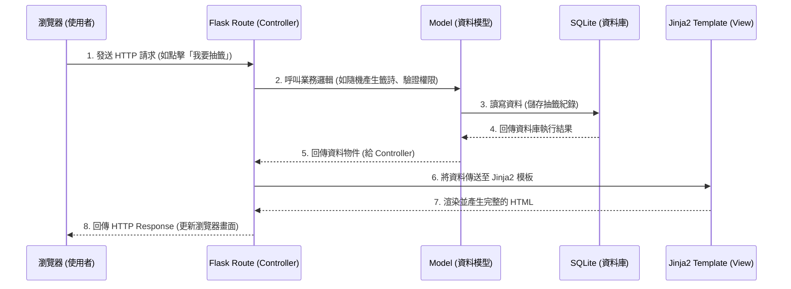

# 系統架構設計文件 (ARCHITECTURE.md)

本文件根據 [PRD.md](PRD.md) 的需求，規劃「線上算命系統」的技術架構與資料夾結構。這是一個基於 Python Flask 的 Web 應用程式，並未採用前後端分離，所有頁面均由伺服器端渲染（Server-Side Rendering, SSR）。

## 1. 技術架構說明

本專案採用輕量級的技術堆疊，以符合快速開發、減少依賴並兼顧系統穩定性為目標。

### 選用技術與原因
- **後端框架：Python + Flask**  
  Flask 是一個輕量、靈活的 Web 框架，適合快速建立 API 與網頁路由，學習曲線較低，且有豐富的擴充套件。
- **模板引擎：Jinja2**  
  搭配 Flask 使用的預設模板引擎。負責將後端處理好的資料（如算命結果與列表）填入 HTML 並回傳，可無縫支援條件渲染與迴圈等功能。
- **資料庫：SQLite (可搭配 sqlite3 或 SQLAlchemy)**  
  作為初期 MVP 開發，輕量且不需額外架設資料庫伺服器的 SQLite 是最佳選擇；利用 SQLAlchemy (ORM) 可確保程式碼與資料庫操作之間的簡潔性，並保留未來轉移的彈性。

### Flask MVC 模式說明
專案依循類似 MVC（Model-View-Controller）的架構進行設計：
- **Model（模型 - `models/`）**：負責與 SQLite 互動，定義資料表結構（例如 `User`, `DivinationRecord`, `Donation` 等資料），並處理資料庫的新增、修改、刪除、查詢。
- **View（視圖 - `templates/` & `static/`）**：負責將資料呈現給使用者。由 Jinja2 渲染 HTML 模板，搭配靜態資源（CSS、JavaScript）打造使用者互動介面。
- **Controller（控制器 - `routes/`）**：負責處理使用者的 HTTP 請求。接收來自瀏覽器的表單或操作，呼叫對應的 Model 處理商業邏輯（如產生籤詩、密碼驗證），最後選擇正確的 Template 回傳。

## 2. 專案資料夾結構

為了讓開發團隊能清楚掌握程式碼位置，並保持專案整潔，資料夾結構將依循關注點分離原則：

```text
web_app_development/
├── app/                        # 應用程式主要資料夾
│   ├── __init__.py             # Flask app 初始化 (如註冊 Blueprints)
│   ├── models/                 # 資料庫模型 (Model)
│   │   ├── __init__.py
│   │   ├── user.py             # 使用者(User)資料表處理
│   │   ├── divination.py       # 算命紀錄(DivinationRecord)處理
│   │   └── donation.py         # 捐獻紀錄(Donation)處理
│   ├── routes/                 # 路由控制器 (Controller)
│   │   ├── __init__.py
│   │   ├── auth.py             # 登入/註冊/登出 相關路由
│   │   ├── divination.py       # 抽籤/算命/儲存結果 相關路由
│   │   ├── donation.py         # 捐香油錢 相關路由
│   │   └── main.py             # 首頁/每日運勢 等共用路由
│   ├── templates/              # HTML 模板 (View)
│   │   ├── base.html           # 共同的版型 (Header, Footer, Navbar)
│   │   ├── index.html          # 首頁
│   │   ├── auth/               # 登入與註冊頁面 (login.html, register.html)
│   │   ├── divination/         # 算命/抽籤頁面 (draw.html, result.html, history.html)
│   │   └── donation/           # 捐款頁面 (donate.html)
│   └── static/                 # 靜態資源檔案
│       ├── css/                # 樣式表 (設計神祕感與美學 UI)
│       ├── js/                 # 互動腳本 (主宰動畫、互動彈出等)
│       └── images/             # 各式圖片 (籤詩圖片、背景圖等)
├── instance/                   # 存放本機運行的資料，不進入 Git
│   └── database.db             # SQLite 資料庫檔案
├── docs/                       # 專案文件目錄
│   ├── PRD.md                  # 產品需求文件
│   └── ARCHITECTURE.md         # 系統架構設計文件 (本檔案)
├── requirements.txt            # Python 套件庫依賴清單
└── app.py                      # 系統啟動進入點 (Entry Point)
```

## 3. 元件關係圖

以下展示使用者從瀏覽器發送請求，到最終獲取網頁畫面的系統流程與資料流向（Data Flow）：



## 4. 關鍵設計決策

1. **伺服器端渲染 (SSR, Server-Side Rendering)**
   - **原因**：為了加速 MVP 開發時程。這讓我們免去了實作複雜的前端架構和處理前後端分離常遇見的 CORS 及登入狀態管理負擔。HTML 直接由後端 Jinja2 渲染後回傳給使用者。
2. **採用 Flask Blueprints (藍圖) 切割路由**
   - **原因**：將不同功能的路由分開（例如：認證 `auth`、功能 `divination`、支付 `donation`），避免未來系統發展使得單一檔案難以維護，這也讓協作開發時不易發生衝突。
3. **選擇 SQLite 作為資料庫**
   - **原因**：線上算命系統不需要立刻面對大量的高併發寫入，SQLite 以單一檔案的形式存在於系統中，省去了安裝部署與建立資料庫伺服器的成本，對初期的 MVP 是最經濟且敏捷的選擇。
4. **將互動體驗留給原生前端語法 (Vanilla CSS/JS)**
   - **原因**：為了呈現算命系統神祕、靈性且高級的質感，會仰賴精緻的 CSS 與微小且流暢的動畫，這不需要像 React 等繁雜的元件庫，用最基礎的原生工具反而能保有極大的排版與互動自由度，不會影響效能。
