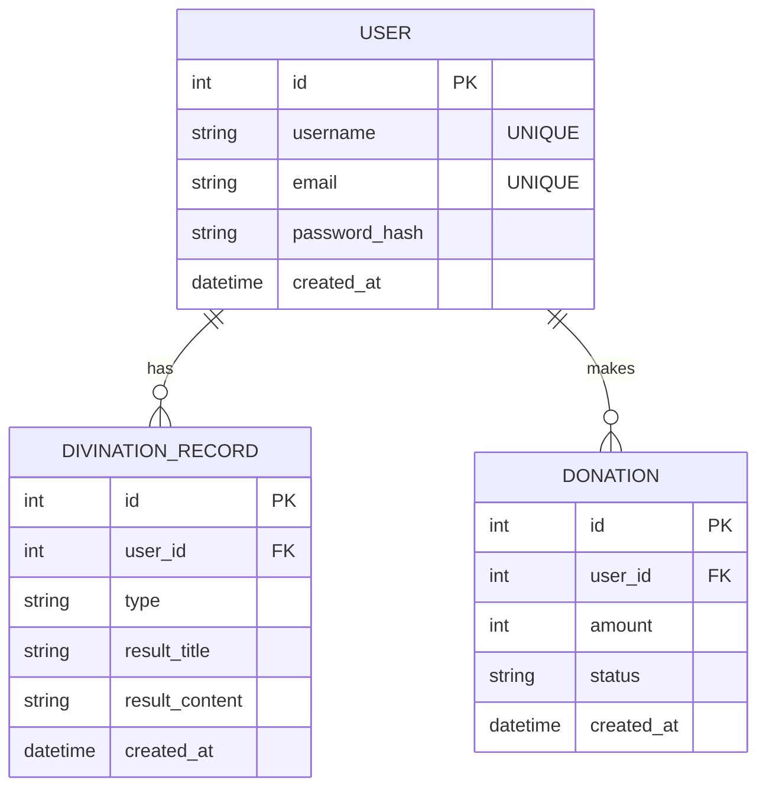

# 資料庫設計文件 (DB_DESIGN.md)

根據 PRD 與系統架構設計，本系統包含三個核心實體：使用者（User）、算命紀錄（DivinationRecord）以及捐獻紀錄（Donation）。資料庫採用 SQLite。

## 1. ER 圖（實體關係圖）

## 2. 資料表詳細說明

### 2.1. `users` (使用者表)
紀錄會員的基本資訊與登入憑證。
- `id` (INTEGER): Primary Key，自動遞增。
- `username` (TEXT): 帳號名稱，必填且唯一。
- `email` (TEXT): 電子郵件，必填且唯一。
- `password_hash` (TEXT): 加密後的密碼，必填。
- `created_at` (DATETIME): 帳號建立時間，預設為當下時間。

### 2.2. `divination_records` (算命紀錄表)
儲存使用者每次操作算命、抽籤的結果。
- `id` (INTEGER): Primary Key，自動遞增。
- `user_id` (INTEGER): Foreign Key，關聯至 `users.id`，必填。
- `type` (TEXT): 算命類型（如：'抽籤', '塔羅', '運勢'），必填。
- `result_title` (TEXT): 算命結果標題（例如籤詩名稱），必填。
- `result_content` (TEXT): 算命詳細解說，必填。
- `created_at` (DATETIME): 抽籤/建立時間，預設為當下時間。

### 2.3. `donations` (捐獻紀錄表)
紀錄使用者在線上的添香油錢或捐款行為。
- `id` (INTEGER): Primary Key，自動遞增。
- `user_id` (INTEGER): Foreign Key，關聯至 `users.id`，必填。
- `amount` (INTEGER): 捐獻金額，必填。
- `status` (TEXT): 付款狀態（如 'pending', 'completed', 'failed'），必填。
- `created_at` (DATETIME): 訂單建立時間，預設為當下時間。

## 3. SQL 建表語法
完整的建表語法儲存於 `database/schema.sql`，並已啟用 SQLite 的 Foreign Key 約束。

## 4. Python Model 程式碼
各個 Table 的 CRUD 邏輯已實作於 `app/models/` 目錄下的對應檔案中，使用原生的 `sqlite3` 函式庫以輕量實作，包含 `create`, `get_all`, `get_by_id`, `update`, `delete` 等方法。
