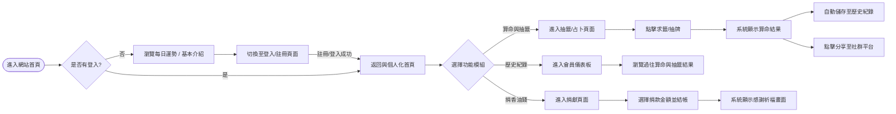
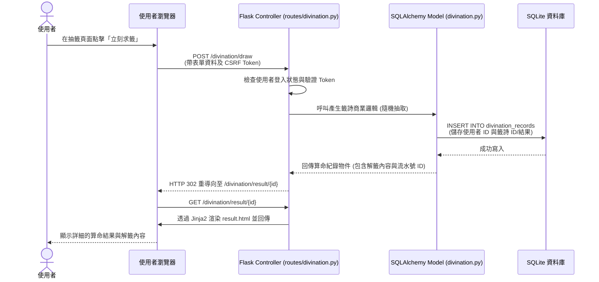

# 系統流程圖設計文件 (FLOWCHART.md)

本文件依據 [PRD.md](PRD.md) 的需求與 [ARCHITECTURE.md](ARCHITECTURE.md) 的架構設計，將「線上算命系統」的互動與資料流視覺化。提供開發人員在著手開發前，確認使用者的操作行為邊界與系統響應模式。

## 1. 使用者流程圖（User Flow）

此流程圖描述使用者從進入網站開始的操作路徑，包含主功能的使用與權限判斷。

## 2. 系統序列圖（Sequence Diagram）

此序列圖具體描述使用者進行「線上抽籤並儲存紀錄」操作時，系統各元件間的資料傳遞。

## 3. 功能清單與路由對照表

本表列出系統所有的核心功能與其對應的 URL 路徑 (Endpoint) 及 HTTP 方法，供後續實作路由時參考：

| 功能模組 | 操作描述 | HTTP 方法 | URL 路徑 |
| --- | --- | --- | --- |
| **首頁與運勢** | 瀏覽首頁與每日運勢 | `GET` | `/` |
| **帳號管理** | 顯示註冊頁面 / 送出註冊資料 | `GET` / `POST` | `/auth/register` |
| **帳號管理** | 顯示登入頁面 / 送出登入資訊 | `GET` / `POST` | `/auth/login` |
| **帳號管理** | 使用者登出 (清除 Session) | `GET` | `/auth/logout` |
| **算命與抽籤** | 顯示可選擇的算命/抽籤項目清單 | `GET` | `/divination` |
| **算命與抽籤** | 執行抽籤/占卜並儲存結果 (寫入 DB) | `POST` | `/divination/draw` |
| **算命與抽籤** | 查看單一算命/抽籤的詳細結果與分享 | `GET` | `/divination/result/<id>` |
| **歷史紀錄** | 瀏覽該使用者的所有過往算命紀錄 | `GET` | `/divination/history` |
| **線上捐獻** | 顯示捐款表單與選擇方案 | `GET` | `/donation` |
| **線上捐獻** | 送出捐款請求/模擬建立訂單 | `POST` | `/donation/donate` |
| **線上捐獻** | 捐款成功感謝與祈福畫面 | `GET` | `/donation/success` |
